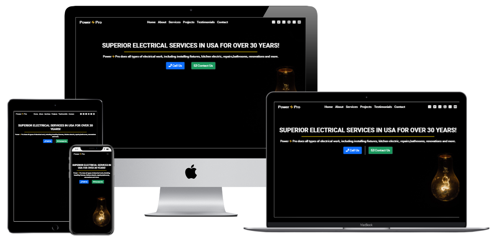

<h1 align="center">Power⚡Pro Electrician Website Milestone 1</h1>

[Check out the live project here.](https://p-lundkvist.github.io/Electrician-website-milestone-project-1/)

This project is from an idea I got after talking to an old friend. He had just started an electrician company but had no website and no idea how to make one, hence why I did this project.

The website is created using the bootstrap framework, meaning it's responsive by default and it's mobile-first design, then working your way up to bigger devices.

The Power⚡Pro website is designed and formed so that customers looking to hire professional electricians quickly can find their way thru on the website.

<h2 align="center"></h2>

## User Experience (UX)

-   ### User stories

    -   #### First Time Visitor/Customer Goals

        1. As a First Time Customer, I want to easily understand the main purpose of the site, where it's located and learn more about the service offered.
        2. As a First Time Visitor/Customer, I want it to be easy to find the different sections, contact options etc.
        3. As a First Time Visitor/Customer, I want to find testimonials to understand what their customers feel and think of Power⚡Pro, Are they trusted? How is the customer service, Are they cheap or expensive, Do they have Social Media presence?

    -   #### Returning Visitor Goals

        1. As a Returning Visitor/Customer, I want to find more information about the services they offer.
        2. As a Returning Visitor/Customer, I want to find the best way to get in contact with the company with any queries I may have.
        3. As a Returning Visitor/Customer, I want to find offers available, incentives to hire the company.

    -   #### Frequent User Goals
        1. As a Frequent Customer, I want to get discounts and VIP customer support.
        2. As a Frequent Customer, I want to be contacted if any new products I'm interested in arrives.
        3. As a Frequent Customer, I want to be able to sign up to a Newsletter so that I am emailed if any big updates and/or changes to the website or company.
